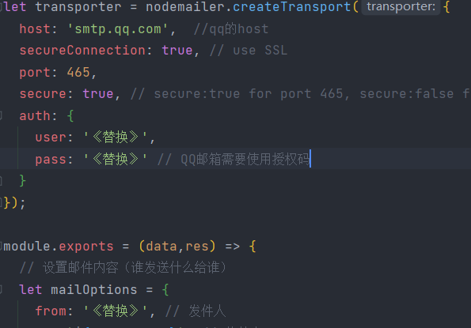
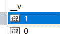
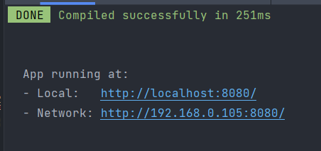
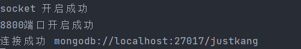
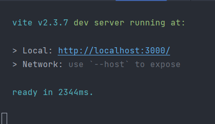
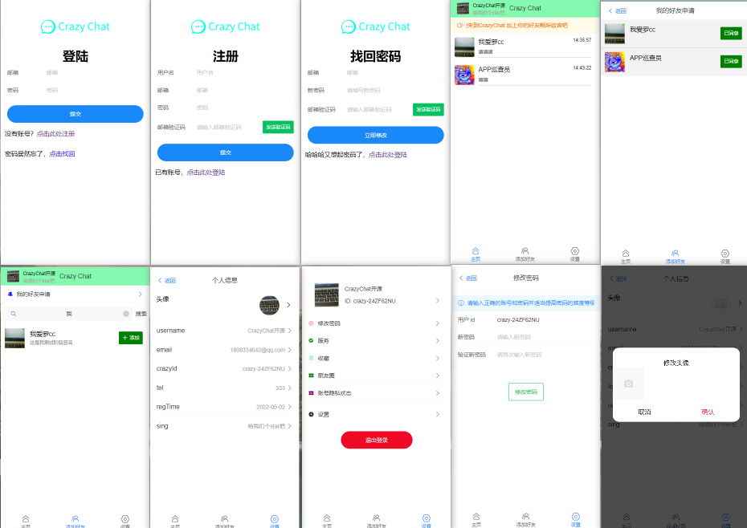
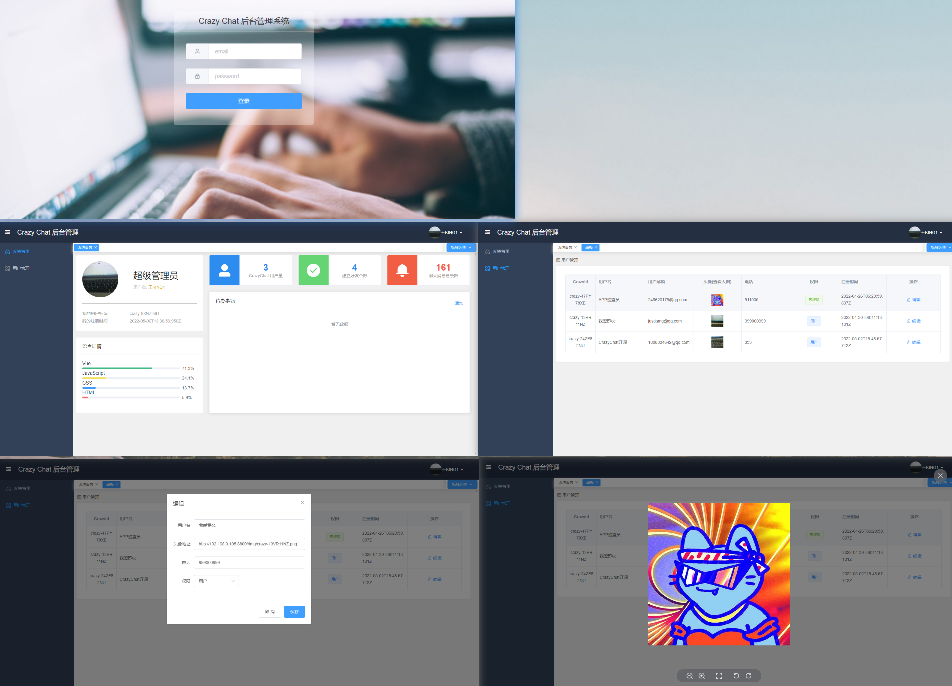
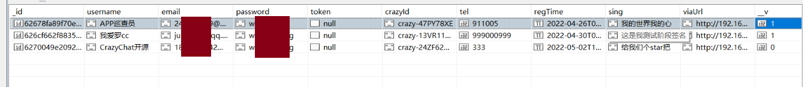

# CrazyChat 即时通讯项目
## 项目主要技术依赖
客户端（vue2+VantUI）+服务端（nodejs+soketio+express）+后台系统（vue3+elementPlus）

## 写在前面
- 服务端依赖了邮件发送模块 nodemailer模块
- 因开源前对代码进行整理 把此模块的发送消息的配置修改了
- 在跑起来此项目前你需要对 nodemailer有一些了解 并进行相关配置
- 网上相关教程：https://blog.csdn.net/d1sappearry/article/details/103953201
- 相关需要替换的内容我会用 《替换》 这个来代替 对应替换即可
- 
- 特别提醒：第一次使用后台系统会有权限验证需要手动将数据库的账号中__v改为1
- 

## 项目目录及运行
    客户端 (8080端口)
    cd crazy-chat
    npm run serve

    
    服务端(依赖mongodb 连接到27017/justkang ) (8800端口和8801端口【socket服务】)
    cd crazy_chatNodeServer
    nodemon index.js  或者 node index.js

    后台系统 （3000端口）
    cd vue-manage-system
    npm run dev

### 项目预览

#### 客户端（部分页面）

#### 后台系统 

#### 数据库预览（studio 3T）
- 登录后台系统需要手动将__v改为1

## 总体总结 
- 除了解三个文件启动方式外 还需要修改邮箱模块的一些配置 位置（crazy_chatNodeServer/db/DAO/email/sendEmail）
- 后台接口：所有后台接口成功都是返回200，失败是401，402
- 接口文档 baseURl: 本地8800接口
  - /login 登录 POST 携带参数:{password,username}  返回:{code:"200",msg:"登陆成功",token:''} ||{code:"401",msg:""} 
  - /getEmailCode 获取验证码 POST 携带参数:{email}  返回:{code: '200', msg: '邮件发送成功，请查收'} || {code:"401",msg:""}
  - /register 注册 POST 携带参数:{password,username，email,emailCode} 返回:{code: '200', msg: '注册成功'} || {code:"401",msg:""}
  - /myInfo 获取个人数据 POST 携带参数：headers：'crazytoken':token 返回:{code: '200', data:{}} || {code:"401",msg:""}
  - /friendList 获取朋友列表 POST 携带参数：headers：'crazytoken':token 返回:{code: '200', data:{}} || {code:"401",msg:""}
  - /findUser 搜索好友列表 POST 携带参数：data:{username},headers：'crazytoken':token 返回:{code: '200', data:{}} || {code:"401",msg:""}
  - /updateUser 修改个人信息 POST 携带参数：data:{username || tel || sing},headers：'crazytoken':token 返回:{code: '200', msg:‘修改成功’} || {code:"401",msg:""}
  - /fileImg 上传头像 POST 携带参数：data:{base64:图片的base64},headers：'crazytoken':token 返回:{code: '200', msg:‘修改成功’} || {code:"401",msg:""}
  - /addFriend 添加好友 POST 携带参数：data:{friendId},headers：'crazytoken':token 返回:{code: '200', msg:‘添加成功’} || {code:"401",msg:""}
  - /findFriendInfo 查找朋友信息 POST 携带参数：data:{friendId},headers：'crazytoken':token 返回:{code: '200', msg:‘添加成功’} || {code:"401",msg:""}
  - /updateFriendState 更新朋友状态 POST 携带参数：data:{friendId,state:1[添加]||2[拒绝]},headers：'crazytoken':token 返回:{code: '200', msg:‘’} || {code:"401",msg:""}
  - /getChatList 获取聊天列表 POST 携带参数：data:{Fid},headers：'crazytoken':token 返回:{code: '200', msg:‘’} || {code:"401",msg:""}
  - /findPassword 找回密码 POST 携带参数：data:{password,emial,emailCode},headers：'crazytoken':token 返回:{code: '200', msg:‘’} || {code:"401",msg:""}
  - admin模块  
  - /adminLogin 管理员登录 POST 携带参数：data:{email,password} 返回:{code: '200',data:{token} || {code:"401",msg:""}
  - /userNumAndchatNum 返回用户个数及聊天个数及组成好友个数 POST 携带参数：headers:{crazytoken} 返回:{code: '200', msg:‘’} || {code:"401",msg:""}
  - /adminfindAlluser 查找用户 POST 携带参数：headers:{crazytoken} 返回:{code: '200', data：{}} || {code:"401",msg:""}
  - /adminfindAlluser 查找用户 POST 携带参数：headers:{crazytoken} 返回:{code: '200', data：{}} || {code:"401",msg:""}
  - /adminChangeUser 修改用户信息 POST 携带参数：data：{crazyId,changeData:{username,viaUrl,tel,__v}}，headers:{crazytoken} 返回:{code: '200', data：{}} || {code:"401",msg:""}

## 写在最后
  - 第一次做开源练习项目，让我们共同进步 
  - 最后感谢我的好友与我共同完成 他的gitee：https://gitee.com/zyangitee QQ：1296126021
  - 如果你想加入我们一同打造更多好玩更有意思的开源项目 QQ：246620179
  - 如果觉得有帮助记得starss
  - 项目开源地址：
    - github：
    - gitee：
    - 视频介绍：

